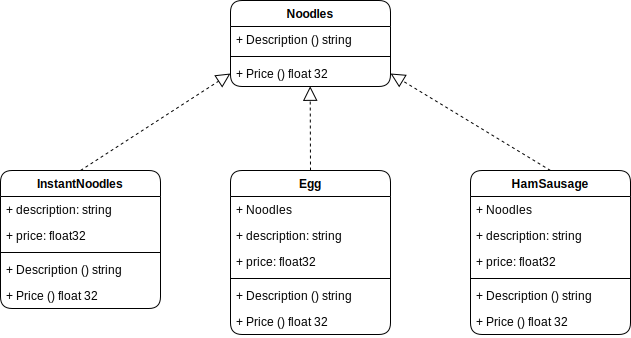

# 设计模式 - 装饰模式

装饰模式是在不改变原有对象的基础之上，将功能附加到对象上。提供了弹性的替代方案（扩展原有对象功能）

## 认识

举例解释装饰模式的定义，现在呢，我们吃一碗红烧牛肉泡面，这个月发工资了想吃个大餐，我给这碗面条，加一根火腿肠，一根鸡蛋来丰富一下，发现不够吃我要再加一个鸡蛋变成双蛋火腿红烧牛肉面让我的胃满满当当。



这里有3个对象，泡面，鸡蛋，火腿肠。在设计模式中泡面就是被装饰对象（）；鸡蛋，火腿肠就是装饰者对象（）。理论上只要我能吃的下有钱，我想加多少就加多少，从类图的角度来看一下。
1. 装饰者和被装饰者对象有相同的超类型
2. 可以用一个或者多个装饰者包装一个对象
3. 既然装饰者和被装饰对象有相同的超类型，所以在任何需要原始对象（被包装的）的场合，可以用装饰过的对象代替它。
4. 装饰者可以在所委托被装饰者的行为之前与 / 或之后，加上自己的行为，以达到特定的目的。
5. 对象可以在任何时候被装饰，所以可以在运行时动态地、不限量地用你喜欢的装饰者来装饰对象。

* 在Go语言中使用匿名组合和非侵入式接口实现



## Go代码
### 1. 定义抽象的被装饰者
``` Go
type Noodles interface {
	Description() string
	Price() float32
}
```

### 2. 定义方便面（被装饰者）
``` Go
type InstantNoodles struct {
	description string
	price       float32
}

func (i *InstantNoodles) Description() string {
	return i.description
}

func (i *InstantNoodles) Price() float32 {
	return i.price
}
```

### 3. 定义鸡蛋（装饰者A - 加了鸡蛋的方便面）
``` Go
type Egg struct {
	noodles     Noodles
	description string
	price       float32
}

func (e *Egg) Description() string {
	return e.noodles.Description() + "+" + e.description
}

func (e *Egg) Price() float32 {
	return e.noodles.Price() + e.price
}
```

### 4. 定义火腿肠（装饰者B - 加了火腿肠的方便面）
``` Go
type HamSausages struct {
	noodles     Noodles
	description string
	price       float32
}

func (h *HamSausages) Description() string {
	return h.noodles.Description() + "+" + h.description
}

func (h *HamSausages) Price() float32 {
	return h.noodles.Price() + h.price
}
```

### 5. 测试 
``` Go
// 1. 我们下一碗方便面
instantNoodles := InstantNoodles{"老坛酸菜牛肉面", 4}
fmt.Println(instantNoodles.Description())
fmt.Println(instantNoodles.Price(), "元")
fmt.Println("--------------------------------")

// 2. 面条里面加个蛋（鸡蛋方便面）
eggInstantNoodles := Egg{&instantNoodles, "鸡蛋", 0.5}
fmt.Println(eggInstantNoodles.Description())
fmt.Println(eggInstantNoodles.Price(), "元")
fmt.Println("--------------------------------")

// 3. 在加一个火腿肠（鸡蛋火腿肠方便面）
HamAndEggInstantNoodles := HamSausages{&eggInstantNoodles, "火腿肠", 2.0}
fmt.Println(HamAndEggInstantNoodles.Description())
fmt.Println(HamAndEggInstantNoodles.Price(), "元")
fmt.Println("--------------------------------")

// 4. 不够吃再来一个蛋（双蛋火腿肠老坛酸菜牛肉面）
HamAnd2EggInstantNoodles := Egg{&HamAndEggInstantNoodles, "鸡蛋2", 0.5}
fmt.Println(HamAnd2EggInstantNoodles.Description())
fmt.Println(HamAnd2EggInstantNoodles.Price(), "元")
fmt.Println("---------------这酸爽！-----------------")
```
```
=== RUN   Test
老坛酸菜牛肉面
4 元
--------------------------------
老坛酸菜牛肉面+鸡蛋
4.5 元
--------------------------------
老坛酸菜牛肉面+鸡蛋+火腿肠
6.5 元
--------------------------------
老坛酸菜牛肉面+鸡蛋+火腿肠+鸡蛋2
7 元
---------------这酸爽！-----------------
--- PASS: Test (0.00s)
PASS
```

## 使用场景
1. 扩展一个结构体的功能或者给一个结构体添加附加职责
2. 给一个对象动态的添加功能，或动态撤销功能
3. 给工具包包装，方便日后更新维护工具包

## 分析
优点
1. 比较灵活，不改变原有对象的情况下给一个对象扩展功能。（
2. 通过使用不同装饰类以及这些类的排列组合，可以实现不同的效果。
3. 符合开闭原则

缺点
1. 会出现更多的代码，更多的类，增加程序的复杂性。
2. 动态装饰时，多层装饰时会更复杂，使用装饰者模式会增加对象的数量，当对象的数量增加到一定的级别时，无疑会大大增加我们代码调试的难度
