# 设计模式 - 观察者模式（推模型与拉模型）

观察者模式（又被称为发布-订阅（Publish/Subscribe）模式，属于行为型模式的一种，它定义了一种一对多的依赖关系，让多个观察者对象同时监听某一个主题对象。这个主题对象在状态变化时，会通知所有的观察者对象，使他们能够自动更新自己。

## 认识
在观察者模式中，分为推模型和拉模型两种方式。

* 推模型
   主题对象观察者推送主题的详细信息，不管观察者是否需要，观察者都会收到。
    
* 拉模型
    主题对象在通知观察者的时候，只传递少量的信息。如果观察者需要更具体的信息，由观察者主动到主题对象中获取，相当于观察者从主题对象中拉数据。一般这种模型的实现中，会把主题对象通过update( )传送，这样在观察者需要获取数据的时候，通过引用获取数据。
    
举例解释观察者模式的含义，在新浪微博中关注一个大V，每当这个大V发布一条微博的时候，关注他的所有粉丝都会收到。



这里有两个对象，微博大V，粉丝。在设计模式中微博大V就是主题对象(Subject)，粉丝是观察者对象(Observer)。不过大V有权利让你关注，也有权利把你拉黑，从类图的角度来看一下。



从上面我们可以看到，这里面包含了两大类（主题和观察者）一共四个角色：

1. Subject：抽象主题，他把所有观察者对象保存在一个集合里，可以有任意数量的观察者，抽象主题提供一个接口，可以增加和删除观察者对象。意思就是明星把所有的粉丝都保存在一个账号里面，粉丝数量不限，可以新增粉丝也可以拉黑粉丝。

2. BigV：具体主题，该角色将有关状态存入具体观察者对象，在具体主题的内部状态发生改变时，给所有注册过的观察者发送通知。意思是我们的明星一有动态，就会把消息给粉丝。

3. Observer：抽象观察者，是观察者者的抽象类，它定义了一个更新接口，使得在得到主题更改通知时更新自己。这就是我们所有粉丝的抽象。

4. Fans：具体观察者，实现抽象观察者定义的更新接口，以便在得到主题更改通知时更新自身的状态。具体每一个粉丝。

## Go代码 - 推模型(push)
### 1. 定义抽象观察者 (Observer)
``` Go
type Observer interface {
	Update(message string)
}
```

### 2. 具体的观察者对象 (Fans)
``` Go
type Fan struct {
	fanName string
}

func (f *Fan) Update(message string) {
	fmt.Println(f.fanName + "收到了：" + message + "通知")
}
```

### 3. 定义抽象主题 (Subject)
``` Go
type Subject interface {
	// 增加粉丝
	AddFan(fan Observer)
	// 拉黑粉丝
	DelFan(fan Observer)
	// 告诉粉丝我的状态
	Notify(msg string)
}
```

### 4. 具体的主题对象 (BigV) 
``` Go
type BigV struct {
	fanList map[Observer]string
}

func (b *BigV) AddFan(fan Observer) {
	b.fanList[fan] = "0"
}

func (b *BigV) DelFan(fan Observer) {
	delete(b.fanList, fan)
}

func (b *BigV) Notify(msg string) {
	for k, _ := range b.fanList {
		k.Update(msg) //通知每一个粉丝消息
	}
}
```

### 5. 测试 
``` Go
func Test(t *testing.T) {

	// 1. 制造一个明星 有一个粉丝列表
	idol := BigV{map[Observer]string{}}

	// 2. 制造很多粉丝
	fanA := Fan{"老张"}
	fanB := Fan{"老何"}
	fanC := Fan{"老吴"}

	// 3. 粉丝关注明星（反过来，明星把他们拉进来）
	idol.AddFan(&fanA)
	idol.AddFan(&fanB)
	idol.AddFan(&fanC)

	// 4. 明星发动态，粉丝获取动态
	idol.Notify("618演唱会，关注免费送门票")
	idol.DelFan(&fanA) // 拉黑一个粉丝
	idol.Notify("还有90张，家人们，快关注啊！")

}
```
```
=== RUN   Test
老张收到了：618演唱会，关注免费送门票通知
老何收到了：618演唱会，关注免费送门票通知
老吴收到了：618演唱会，关注免费送门票通知
老何收到了：还有90张，家人们，快关注啊！通知
老吴收到了：还有90张，家人们，快关注啊！通知
--- PASS: Test (0.00s)
PASS
```

## Go代码 - 拉模型(pull)
拉模型与推模型的区别很小

### 1. 定义抽象观察者（Observer）
拉模型的观察者Update方法接收一个主题对象
``` Go
type Observer interface {
	Update(sb Subject)
}
``` 

### 2. 具体的观察者对象（Fans）
这里举例观察者对象中维护一个微博数据，需要从主题对象这里获取
``` Go
type Fan struct {
	// 微博详细信息
	blog    Blog
	fanName string
}

func (f *Fan) Update(sb Subject) {
	f.blog = sb.GetMessage()
}
```

### 3. 定义抽象主题对象（Subject）
这里增加一个添加方法AddMessage(blog Blog),和获取方法GetMessage() Blog，并且把通知粉丝修改为私有方法不在传递数据。
``` Go
type Subject interface {
	// 增加粉丝
	AddFan(fan Observer)
	// 拉黑粉丝
	DelFan(fan Observer)
	// 告诉粉丝我的状态 （通知每个观察者，非公开）
	notify()
	// 添加微博
	AddMessage(blog Blog)
	// 获取详细的微博内容
	GetMessage() Blog
}
```
### 4. 具体的主题对象（BigV）
注意notify()中修改不在发送数据给观察者，而是将主题对象自身发送给观察者
``` Go
type BigV struct {
	// 微博内容
	blog    Blog
	fanList map[Observer]string
}

func (b *BigV) AddFan(fan Observer) {
	b.fanList[fan] = "0"
}

func (b *BigV) DelFan(fan Observer) {
	delete(b.fanList, fan)
}

func (b *BigV) notify() {
	for k, _ := range b.fanList {
		k.Update(b) //通知每一个粉丝消息
	}
}

func (b *BigV) AddMessage(blog Blog) {
	b.blog = blog
	log.Println("[pull]", "发布一条新微博:", b.blog.Title)
	b.notify()
}
```

### 5. Blog对象（数据）
``` Go
type Blog struct {
	Id      int32
	Title   string
	Content string
}
```

### 6. 测试
``` Go
// 1. 制造一个明星 有一个粉丝列表
idol := BigV{fanList: map[Observer]string{}}

// 2. 制造很多粉丝
fanA := Fan{fanName: "老张"}
fanB := Fan{fanName: "老何"}
fanC := Fan{fanName: "老吴"}

// 3. 粉丝关注明星（反过来，明星把他们拉进来）
idol.AddFan(&fanA)
idol.AddFan(&fanB)
idol.AddFan(&fanC)

// 4. 明星发布一条新微博
blog := Blog{Id: 1, Title: "618演唱会", Content: "618演唱会，关注免费送门票"}
idol.AddMessage(blog)

// 5. 粉丝获取博客部分信息
fmt.Println(fanA.blog.Title)
fmt.Println(fanB.blog.Content)
fmt.Println(fanA.blog.Id)
```
```
=== RUN   Test
2020/06/16 22:54:12 [pull] 发布一条新微博: 618演唱会
618演唱会
618演唱会，关注免费送门票
1
--- PASS: Test (0.00s)
PASS
``` 

## 使用场景
1. 一个抽象模型有两个方面，其中一个方面依赖于另一个方面。将这些方面封装在独立的对象中使他们可以各自独立的改变和复用。
2. 一个对象必须通知其他对象，而不知道这些对象是谁。
3. 一个对象的改变将导致其他一个或多个对象也发生改变，而不知道具体有多少对象将发生改变，可以降低对象之间的耦合度。
4. 需要在系统中创建一个触发链，A对象的行为将影响B对象，B对象的行为将影响C对象......，可以使用观察者模式创建一种链式触发机制。

## 分析
* 推模型是假定主题对象知道观察者需要的数据；而拉模型是主题对象不知道观察者具体需要什么数据，没有办法的情况下，干脆把自身传递给观察者，让观察者自己去按需要取值。
* 避免循环引用

优点
1. 可以实现表示层和数据逻辑层的分离，并在观察目标和观察者之间建立一个抽象的耦合，支持广播通信

缺点
1. 如果一个观察目标对象有很多直接和间接的观察者的话，将所有的观察者都通知到会花费很多时间
2. 观察者和观察目标之间有循环依赖的话，观察目标会触发它们之间进行循环调用，可能导致系统崩溃。
3. 推模型可能会使得观察者对象难以复用，因为观察者的update()方法是按需要定义的参数，可能无法兼顾没有考虑到的使用情况。这就意 味着出现新情况的时候，就可能提供新的update()方法，或者是干脆重新实现观察者；而拉模型就不会造成这样的情况，因为拉模型下， update()方法的参数是主题对象本身，这基本上是主题对象能传递的最大数据集合了，基本上可以适应各种情况的需要。
